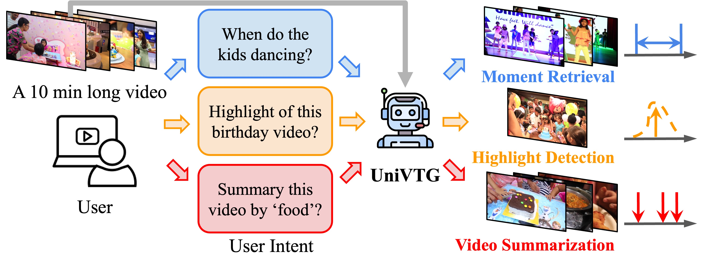

 # UniVTG (ICCV'23)
[](https://paperswithcode.com/sota/highlight-detection-on-qvhighlights?p=univtg-towards-unified-video-language) [](https://paperswithcode.com/sota/moment-retrieval-on-qvhighlights?p=univtg-towards-unified-video-language)

 [[arXiv]](https://arxiv.org/abs/2307.16715)
 
> TL; DR: The first video temporal grounding pretraining model, unifying diverse temporal annotations to power moment retrieval (interval), highlight detection (curve) and video summarization (point).



### 📢 News
<!--  -->
- [2023.8.6] Update the gradio demo.
- [2023.7.31] We release the arXiv paper, codes, checkpoints, and gradio demo.

## 🌟 Run on your videos
To power practical usage, we release the following checkpoints:

| Video Enc.  | Text Enc.  | Pretraining            | Fine-tuning   |  Checkpoints |
| ------------------ |  ------------------ | ------------------ | ------- | ---- |
| CLIP-B/16 | CLIP-B/16 | 4M      | -      |   [Google Drive](https://drive.google.com/drive/folders/1-eGata6ZPV0A1BBsZpYyIooos9yjMx2f?usp=sharing)  |
| CLIP-B/16 | CLIP-B/16 | 4M | QVHL + Charades + NLQ + TACoS + ActivityNet + DiDeMo      |  [Google Drive](https://drive.google.com/drive/folders/1l6RyjGuqkzfZryCC6xwTZsvjWaIMVxIO?usp=sharing)  

Download and put it to the dir `results/omni`.

Additionally, we've built gradio interfaces for easy interaction. 
Run `python3 main_gradio.py --resume /results/omni/model_best.ckpt`

Download the example videos from [here](https://drive.google.com/drive/folders/1TpMYRmdAx5yx-lQu4ivCnAX67voUfBcL?usp=sharing) and put it under `examples/`

<details open><summary>[ Youtube video ]</summary>
</details>
<details open><summary>[ Egocentric video ]</summary>
</details>
<details open><summary>[ Charades video  ]</summary>
</details>

## ⚙️ Preparation

Please find instructions in [install.md](install.md) to setup environment and datasets.

## 📦 Model Zoo

Download checkpoints in [model.md](model.md) to reproduce the benchmark results.

## 🎨 Visualization

If you want to draw visualizations like our paper, you can simply run `python3 plot/qvhl.py` to generate corresponding figures by providing the predicted json.


## 🎓 Citation
If you find our work helps, please cite our paper.

```
@misc{lin2023univtg,
      title={UniVTG: Towards Unified Video-Language Temporal Grounding}, 
      author={Kevin Qinghong Lin and Pengchuan Zhang and Joya Chen and Shraman Pramanick and Difei Gao and Alex Jinpeng Wang and Rui Yan and Mike Zheng Shou},
      year={2023},
      eprint={2307.16715},
      archivePrefix={arXiv},
      primaryClass={cs.CV}
}
```

## ✉️ Contact
This repo is maintained by [Kevin](https://qinghonglin.github.io/). Questions and discussions are welcome via kevin.qh.lin@gmail.com or open an issue.

## 😊 Acknowledgement

This codebase is based on [moment_detr](https://github.com/jayleicn/moment_detr), [HERO_Video_Feature_Extractor](https://github.com/linjieli222/HERO_Video_Feature_Extractor), [UMT](https://github.com/tencentarc/umt).

We thank the authors for their open-source contributions.
